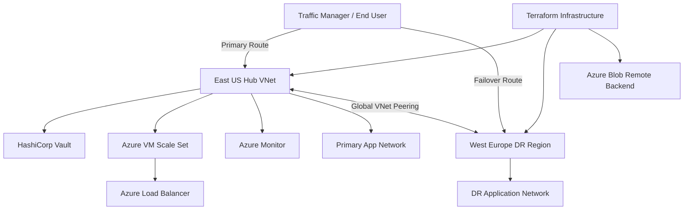

# 🔐 Secure Multi-Region Infrastructure Automation with HashiCorp Vault & Terraform on Azure


Enterprise-grade Azure Infrastructure Automation Platform implementing:

- Infrastructure as Code
- Multi Region Deployment
- Disaster Recovery
- Runtime Secret Retrieval
- HashiCorp Vault Integration
- Remote Terraform Backend
- Monitoring & Observability
- VM Scale Sets
- Load Balancing
- Configuration Automation

---

# 📌 Project Overview

Modern enterprise environments commonly face:

❌ Manual infrastructure provisioning

❌ Infrastructure drift

❌ Secret exposure risk

❌ Configuration inconsistency

❌ Scaling limitations

❌ Lack of disaster recovery

❌ Manual server administration

This project addresses those challenges using enterprise cloud engineering principles.

---

# 🎯 Objectives

✅ Multi Region Infrastructure

✅ Infrastructure as Code

✅ Dynamic Credentials

✅ Secret Rotation

✅ Runtime Secret Retrieval

✅ Monitoring & Visibility

✅ Configuration Automation

✅ Enterprise Scalability

✅ Disaster Recovery

---

# 🛠 Prerequisites

Before deployment ensure required tools are installed.

| Requirement | Version |
|--------------|----------|
| Terraform | v1.5+ |
| Azure CLI | Latest |
| Python | 3.10+ |
| Docker | Latest |
| HashiCorp Vault | Installed |
| Ansible | Latest |
| Azure Subscription | Required |

Authenticate Azure:

```bash
az login
```

Verify Terraform:

```bash
terraform version
```

Verify Azure CLI:

```bash
az --version
```

Verify Vault:

```bash
vault version
```

---

# 🏗 Enterprise Architecture



---

# ⚙ Technology Stack

| Technology | Purpose |
|------------|----------|
| Azure | Cloud Platform |
| Terraform | Infrastructure Provisioning |
| Vault | Secret Management |
| Docker | Container Runtime |
| Ansible | Configuration Management |
| Azure Blob Storage | Remote Backend |
| Azure VMSS | Auto Scaling |
| Azure Load Balancer | Traffic Distribution |
| Azure Monitor | Monitoring |
| Linux | Server Administration |

---

# ⚙ Configuration Variables

Customize deployment using:

`terraform.tfvars`

| Variable | Description | Example |
|-----------|-------------|----------|
| primary_region | Primary Azure region | East US |
| secondary_region | DR Region | West Europe |
| hub_prefix | Hub CIDR | 10.0.0.0/16 |
| spoke_prefix | Spoke CIDR | 10.1.0.0/16 |
| environment | Deployment Environment | prod |
| vm_size | Compute SKU | Standard_B2ms |
| backend_storage | Remote State Storage | tfstate |

Example:

```hcl
primary_region="East US"

secondary_region="West Europe"

hub_prefix="10.0.0.0/16"

environment="prod"

vm_size="Standard_B2ms"
```

---

# 📂 Repository Structure

```text

secure-multi-region-infrastructure-automation/

├── terraform/

├── modules/

│ ├── network/

│ ├── compute/

│ ├── security/

│ └── scaling/

├── ansible/

├── vault/

├── images/

└── README.md

```

---

# 🚀 Deployment Steps

Initialize Terraform:

```bash
terraform init
```

Validate configuration:

```bash
terraform validate
```

Generate execution plan:

```bash
terraform plan
```

Deploy Infrastructure:

```bash
terraform apply
```

Destroy infrastructure:

```bash
terraform destroy
```

---

# 🚀 Infrastructure Capabilities

✅ Multi Region Deployment

✅ Disaster Recovery

✅ Infrastructure as Code

✅ Secret Rotation

✅ Dynamic Credentials

✅ Runtime Secret Retrieval

✅ Remote Backend

✅ VM Scale Set

✅ Load Balancer

✅ Monitoring

✅ Auto Scaling

✅ Configuration Automation

---

# 🔐 Security Features

- HashiCorp Vault Integration
- Dynamic Credential Rotation
- Runtime Secret Retrieval
- Remote Backend State Security
- NSG Isolation
- Multi Layer Network Segmentation
- DR Architecture

---

# 📈 Operational Excellence

Implemented:

- Infrastructure Automation
- Terraform Modules
- Azure Remote State Backend
- Monitoring Visibility
- Configuration Standardization
- Secret Security
- Platform Scalability

---

# 🧠 Skills Demonstrated

Azure Cloud

Terraform

HashiCorp Vault

Infrastructure Automation

Linux Administration

Disaster Recovery

DevOps Automation

Cloud Operations

Monitoring

Networking

Secret Management

Configuration Management

---

# 📈 Final Outcome

Successfully designed and implemented a secure enterprise-grade Azure Infrastructure Automation Platform supporting:

- Disaster Recovery
- Multi Region Architecture
- Secret Security
- Infrastructure Scalability
- Monitoring Visibility
- Runtime Secret Retrieval
- Configuration Automation

---

# 👨‍💻 Author

### Amit Kumar

Cloud Engineer

Azure | Terraform | Vault | DevOps | Automation
