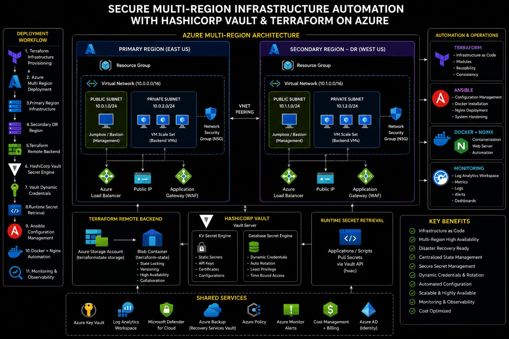

# 🔐 Secure Multi-Region Infrastructure Automation with HashiCorp Vault & Terraform on Azure


Enterprise-grade Azure infrastructure automation platform implementing Infrastructure as Code (IaC), Multi-Region Deployment, Disaster Recovery Architecture, HashiCorp Vault Secret Management, Runtime Secret Retrieval, Remote Backend State Management, Monitoring, and Enterprise Cloud Automation.

---

# 📌 Project Overview

Enterprise environments often face challenges like:

❌ Manual infrastructure provisioning

❌ Infrastructure drift

❌ Secret exposure risk

❌ Lack of disaster recovery planning

❌ Configuration inconsistency

❌ Scaling limitations

❌ Manual server management

This project was designed to solve these problems using Azure enterprise cloud engineering practices.

Goal:

✅ Multi-Region Infrastructure

✅ Infrastructure as Code

✅ Secret Management

✅ Dynamic Credentials

✅ Runtime Secret Retrieval

✅ Remote Backend

✅ Monitoring

✅ Configuration Automation

✅ Enterprise Scalability

---

# 🏗 Enterprise Architecture



Flow:

Terraform

↓

Azure Infrastructure Provisioning

↓

Primary Region Deployment

↓

Secondary DR Region

↓

Remote Backend State Management

↓

Vault Secret Engine

↓

Vault Dynamic Credentials

↓

Runtime Secret Retrieval

↓

Ansible Configuration

↓

Docker + Nginx Automation

↓

Azure Monitoring

↓

VM Scale Set

↓

Load Balancer

---

# ⚙ Technology Stack

| Technology | Purpose |
|------------|----------|
| Azure | Cloud Platform |
| Terraform | Infrastructure Provisioning |
| Vault | Secret Management |
| Ansible | Configuration Management |
| Docker | Container Runtime |
| Nginx | Web Layer |
| Azure VMSS | Auto Scaling |
| Azure Load Balancer | Traffic Distribution |
| Azure Blob Storage | Remote Backend |
| Log Analytics | Monitoring |
| Linux | Server Administration |

---

# 📂 Repository Structure

```text
secure-multi-region-infrastructure-automation/

├── terraform/

├── modules/

│   ├── network/

│   ├── compute/

│   ├── security/

│   └── scaling/

├── ansible/

├── vault/

├── images/

└── README.md
```

---

# 🚀 Implementation Journey

## Phase 1 — Infrastructure Provisioning

### What I Built

Created:

- Azure Resource Groups

- Virtual Networks

- Network Security Groups

- Virtual Machines

- Backend Storage

### Why

Manual provisioning creates inconsistency.

Terraform automation ensures repeatable infrastructure deployment.

### Problem Faced

Terraform local state collaboration issue.

### Root Cause

Local state file risk.

Infrastructure drift.

### Solution

Azure Blob Storage Remote Backend.

### Outcome

Centralized infrastructure state.

Proof:


---

## Phase 2 — Network Architecture

### Problem

Single subnet architecture enterprise security standard follow nahi karti.

### Solution

Implemented:

- Public Subnets

- Private Subnets

- NSG Isolation

### Outcome

Secure network segmentation.

Proof:


---

## Phase 3 — Remote Backend State Management

### Problem

Terraform local backend collaboration risk create karta hai.

### Root Cause

State conflicts.

Infrastructure drift.

### Solution

Azure Blob Storage Backend.

### Outcome

Enterprise backend management.

Proof:


---

## Phase 4 — Monitoring

### Problem

Infrastructure visibility missing.

### Solution

Azure Log Analytics.

### Outcome

Centralized monitoring.

Proof:


---

## Phase 5 — HashiCorp Vault Integration

### Problem

Secrets hardcoding security risk create karta hai.

### Implemented

- Vault KV Secrets

- Dynamic Credentials

- Runtime API Integration

### Problem Faced

Vault database validation failed.

### Root Cause

PostgreSQL localhost binding.

### Solution

listen_addresses='*'

pg_hba.conf update

### Outcome

Dynamic secret rotation operational.

Proof:


---

## Phase 6 — Runtime Vault API Integration

### Problem

Application runtime secret pull failed.

### Root Cause

hvac package unavailable.

### Solution

Python Virtual Environment.

Installed:

- python3-venv

- hvac

### Outcome

Runtime secret retrieval operational.

---

## Phase 7 — Terraform Module Migration

### Problem

Direct resource blocks scalable nahi hote.

### Solution

Terraform modules implementation.

Created:

- Network Module

- Compute Module

- Security Module

- Scaling Module

### Outcome

Reusable infrastructure.

Proof:


---

## Phase 8 — Configuration Automation

### Problem

Manual package installation operational overhead create karta hai.

### Solution

Ansible Automation.

Automated:

- Docker Installation

- Nginx Installation

- Linux Updates

### Problem Faced

SSH automation failed.

### Root Cause

sshpass unavailable.

### Solution

Installed sshpass.

### Outcome

Automated configuration operational.

Proof:


---

## Phase 9 — Enterprise Scaling

### Problem

Single VM architecture scalable nahi.

### Solution

Implemented:

- VM Scale Set

- Load Balancer

### Outcome

Scalable infrastructure architecture.

Proof:


---

# ⚠ Engineering Challenges Solved

### Challenge 01

Terraform backend conflict.

Solution:

Azure Remote Backend.

---

### Challenge 02

Vault DB validation failure.

Solution:

PostgreSQL listener configuration.

---

### Challenge 03

SSH automation failed.

Solution:

sshpass installation.

---

### Challenge 04

Runtime API integration failed.

Solution:

Python Virtual Environment.

---

# 📈 Platform Capabilities

✅ Infrastructure as Code

✅ Multi Region Deployment

✅ Disaster Recovery

✅ Dynamic Credentials

✅ Runtime Secret Pull

✅ Monitoring

✅ VM Scale Set

✅ Load Balancer

✅ Remote Backend

✅ Configuration Automation

---

# 🧠 Skills Demonstrated

- Azure Cloud

- Terraform

- HashiCorp Vault

- Linux Administration

- Infrastructure Automation

- Monitoring

- Disaster Recovery

- Secret Management

- Networking

- DevOps Automation

- Cloud Operations

---

# 📈 Final Outcome

Successfully designed and implemented a secure enterprise-grade Azure infrastructure automation platform supporting disaster recovery capability, secret security, scalable infrastructure design, monitoring visibility, and operational automation.

---

# 👨‍💻 Author

Amit Kumar

Cloud Engineer

Azure | Terraform | Vault | DevOps | Automation
